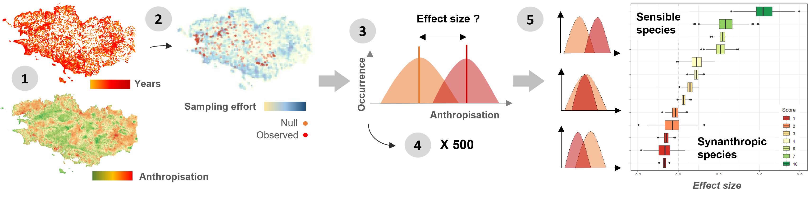

<!-- README.md is generated from README.Rmd. Please edit that file -->

# SynAnthrop 

SynAnthrop is a R package developed to assess the sensibility of species and communities to anthropisation from occurrence data.

The method allows to describe the ecological affinities of species and groups in a simple, reproducible, multi-scale and less subjective way than with expert assessments.

The principle of the analysis is based on the comparison of the observed distribution of species along a gradient of anthropisation within a territory, with a distribution that would be expected if anthropisation had no effect on this distribution (null distribution). This null distribution is defined by species, taking into account its distribution (points are randomly generated within its range) and taking into account the survey intensity per site.

## Workflow 

2 types of data are needed as input (1): georeferenced occurrence data and a map describing the gradient to be studied (from which we extract values at the desired resolution).
After a selection of data by species (2), a random selection of sites in the range and according to the sampling effort is made (n = observed occurrences). The effect (in this case of anthropisation) is measured by evaluating the effect size between these 2 distributions (3). The operation is repeated 500 times (4). Synanthropy scores (from 1 to 10) are assigned to each species from the average of the differences between the null and observed distributions (5).

These scores can then be used at the community scale to estimate the overall sensitivity of assemblages to land use change. These average scores are complementary to anthropisation maps whose information must be considered as potential (with cases where the maps present values > to the scores when sensitive species are not detected and cases where the maps present values < to the scores when in reality some populations of sensitive species have maintained themselves locally).

## Dependencies
### Loading packages and function
```{r Packages, warning = FALSE, message = FALSE, results = 'hide'}
Packages <- c("tidyverse", "raster","scales","sf","ks","tabularaster", "terra", "tidyterra", "CGPfunctions")
# install.packages(Packages) # if needed

lapply(Packages, library, character.only = TRUE) # to load

source("./R/Species_Synanthropy_Index_function.R")
# devtools::install_github("/lomorel/SynAnthrop")
```

### Data

Two types of data are required to run the Species Synanthropy Index (SSI): (i) a database of species occurrences, with XY coordinates and corresponding sampling dates, and (ii) a raster describing the spatial gradient of anthropisation of the region to be analyse.

```{r warning=FALSE, message=FALSE}
sp_by_occ_raw <- read.table("./Data/amphibian_all_2154_to_R.csv", sep=";", h=T)
head(sp_by_occ_raw)
```

Note that data were filter to containt only recent years (2010-2021) in order to be coherent with information compile in used maps.

```{r warning=FALSE, message=FALSE}
ras_raw <- raster("./Data/CartNat_Bzh.tif")#raster
```

The map used here is the French Naturalness Map, developed by Guetté et al.(2021)[https://uicn.fr/CartNat/CartNat_Donnees/Note_technique_m%C3%A9thodologique/Projet%20CARTNAT_note%20technique_2021.pdf)]. 

```{r warning=FALSE, message=FALSE, fig.width=10}
rast_to_plot <- rast(ras_raw)

sp_map <- st_as_sf(sp_by_occ_raw, coords = c("X", "Y"), crs = 2154)
sp_map$Year <- as.integer(sp_map$Year)

ggplot() + 
  geom_spatraster(data = rast_to_plot) +
  geom_sf(data = sp_map, aes(color = Year)) +
  scale_colour_gradient(low = "orange", high = "red") +
  scale_fill_whitebox_c(palette = "muted", direction=-1)
```

## The Species Synanthropy Index function
### An example with amphibian populations in western France

### Usage

The function was designed to calculate synanthropy scores automatically from a data set (for a taxon, a territory and a period). Several resolutions can be evaluated simultaneously.

### Arguments

* `- resolution`: his argument allows to test several resolutions. To do this, specify for each resolution you want to test (the value is the number of raster cells aggregated to compile species occurrences).

* `- sim`: this argument corresponds to the number of simulations to run to model the null distribution of occurrences under the assumption that the variables used for the map (raster) do not influence the species distribution.

* `- threshold`: this argument allows to fix the threshold of species occurrences under it species will be not account.

### Example and results

```{r warning=FALSE, message=FALSE, results = 'hide'}
ssi_results <- ssi(r = ras_raw, x = sp_by_occ_raw, resolution = c(100, 200) , sim = 50, threshold = 30)

```

The SSI function produce three main data.frame :

* `[[1]]` the first data.frame is a short summary table (one line per species) with the mean of all effect size and the corresponding index (range between 1 to 10) for each resolution. The number of runs used to calculate the mean effect size are also specified.

```{r warning=FALSE, message=FALSE, results = 'hide'}
head(ssi_results[[1]])
```

* `[[2]]` the second data.frame compile all the raw results, i.e all the effect size assessed per run, with corresponding information provided by the function cohen_d (rstatix package) ; n1 and n2 correspond to the number of occurrence compare (n1 for the null distribution and n2 for observed data).

```{r warning=FALSE, message=FALSE, results = 'hide'}
head(ssi_results[[2]])
```

* `[[3]]` the third data.frame archives all the occurrence randomly drawn to assess scores.

```{r warning=FALSE, message=FALSE, results = 'hide'}
head(ssi_results[[3]])
```

## Visualise and analyse the SSI results
### Score distribution within the studied taxa
```{r warning=FALSE, message=FALSE}
sp_ssi <- ssi_results [[1]]
sp_ssi$Index <- as.integer(sp_ssi$Index)

mean_ssi_by_resolution <-   data.frame(sp_ssi %>%
                                      group_by(Species, Resolution) %>%
                                      summarise(Index = mean(Index), n = n()))

effsize_res <- ssi_results [[2]]
```

Here we selected only data for the resolution 200.

```{r warning=FALSE, message=FALSE, fig.width=10}
# then scale by scale
sub_effsize_res <- subset(effsize_res, Resolution == "200")
mean_ssi_by_resolution <- subset(mean_ssi_by_resolution, Resolution == "200")

sub_effsize_res <- merge(sub_effsize_res, mean_ssi_by_resolution, by = "Species")
sub_effsize_res$Index <- as.factor(sub_effsize_res$Index)

ggplot(sub_effsize_res, aes(x = reorder(Species, -effsize), y = -effsize, fill = Index)) +
  geom_hline(yintercept = 0.0, color = "darkgrey", size=0.8, linetype="dashed") +
  geom_boxplot() + 
  coord_flip() +
  scale_fill_brewer(name="Score", palette = "RdYlGn") +
  ylab("Effect size") +
  theme(axis.title.y = element_blank()) +
  theme(legend.position = c(0.9, 0.2)) +
  theme_bw()

```

### Resolution comparison

```{r warning=FALSE, message=FALSE, fig.width=10}

mean_index_by_reso <- data.frame(sp_ssi %>%
                                      group_by(Species, Resolution) %>%
                                      summarise(Index = mean(Index), n = n()))

mean_index_by_reso$Resolution <- as.factor(mean_index_by_reso$Resolution)

newggslopegraph(dataframe = mean_index_by_reso,
                Resolution,
                Index,
                Grouping = Species,
                Title = "Synanthropy scores for amphibian species in western France",
                SubTitle = NULL,
                Caption = NULL)
```

### Distribution map

```{r warning=FALSE, message=FALSE, fig.width=10}

sub_distri <- subset(ssi_results[[3]], Resolution == "200")
sub_distri_obs <- subset(sub_distri, variable  == "Obs")
distri <- rbind(sub_distri_obs, sample_n(subset(sub_distri, variable  == "Null" ), nrow(sub_distri_obs)))
distri <- sf_transform_xy (distri, 4326, 2154)

ggplot() + 
  geom_point(data = subset(distri, variable == "Null"), aes(x = x, y = y, color = variable), 
             size = 1.5, colour = "#ff7553",alpha = 1/2) +
  geom_point(data = subset(distri, variable == "Obs"), aes(x = x, y = y, color = variable), 
             size = 1.5, colour = "#d4482c",alpha = 1/2) +
  theme(axis.title.x=element_blank(),axis.title.y=element_blank()) +
  facet_wrap(. ~ Species) +
  theme_void() +
  theme(legend.position="none")
```

## Credits

Package and tutorial written by Loïs Morel, Lab. DECOD, Institut Agro, Rennes, France.

Citations:

* Morel L. 2023. SynAnthrop: Species distribution and sensitivity to anthropisation, R package version 0.1.1,         https://github.com/lomorel/SynAnthrop


