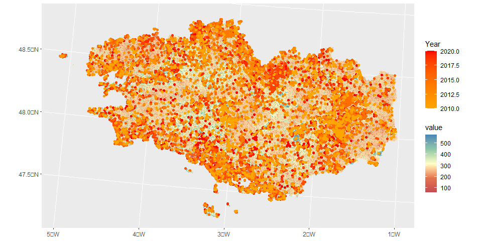
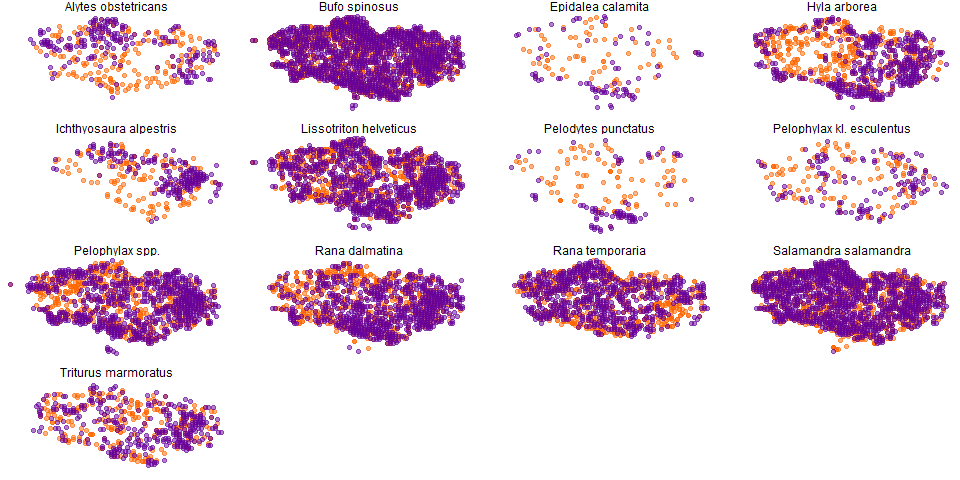
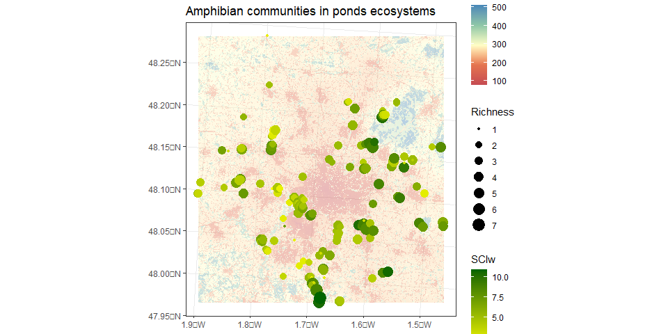

<!-- README.md is generated from README.Rmd. Please edit that file -->

# SynAnthrop : a R package to analyse species distribution along anthropisation gradient 

SynAnthrop is a R package developed to assess the sensibility of species
and communities to anthropisation from occurrence data.

The method allows to describe the ecological affinities of species and
groups in a simple, reproducible, multi-scale and less subjective way
than with expert assessments.

The principle of the analysis is based on the comparison of the observed
distribution of species along a gradient of anthropisation within a
territory, with a distribution that would be expected if anthropisation
had no effect on this distribution (null distribution). This null
distribution is defined by species, taking into account its distribution
(points are randomly generated within its range) and taking into account
the survey intensity per site.

## Workflow 

Two types of data are needed as input (1): georeferenced occurrence data
and a map describing the gradient to be studied (from which we extract
values at the desired resolution). After a selection of data by species
(2), a random selection of sites in the range and according to the
sampling effort is made (n = observed occurrences). The gradient effect
(of anthropisation in our case) is measured by evaluating the effect
size between these 2 distributions (3). The operation is repeated 500
times (4). Synanthropy scores (from 1 to 10) are assigned to each
species from the average of the differences between the null and
observed distributions (5).

These scores can then be used to identify species, communities, and
related habitats that require significant conservation and restoration
effort. They are complementary to other existing prioritisation indices
such as red lists, rarity or specialization degrees.

## Dependencies

### Loading packages and function associated to the SynAnthrop R package

``` r
Packages_fund <- c("tidyverse",# to cook data 
              "raster", "sf", # for spatial data
              "ks", # to use kernel density to estimate sampling effort
              "rstatix", "scales" # to assess effect size
              )

source("./R/Species_Synanthropy_Index_function.R")
# devtools::install_github("/lomorel/SynAnthrop")
```

### Complement packages to applied the following example

``` r
Packages_rel <- c("ggplot2", "terra","tidyterra","CGPfunctions", "RColorBrewer")
```

### Load all the packages

``` r
Packages <- c(Packages_fund,Packages_rel)
  
# install.packages(Packages) # if needed

lapply(Packages, library, character.only = TRUE) # to load
```

## The Species Synanthropy Index function

### An example with amphibian populations in western France

### Data

Two types of data are required to run the Species Synanthropy Index
(SSI): (i) a database of species occurrences, with XY coordinates and
corresponding sampling dates, and (ii) a raster describing the spatial
gradient of anthropisation of the region to be analyse.

``` r
sp_by_occ_raw <- read.table("./Data/amphibian_all_2154_to_R.csv", sep=";", h=T)
head(sp_by_occ_raw)
```

    ##                 Species Year Abundance      X       Y
    ## 1         Bufo spinosus 2015         1 259519 6807029
    ## 2       Pelophylax spp. 2015         1 259519 6807029
    ## 3 Salamandra salamandra 2015         1 259519 6807029
    ## 4         Bufo spinosus 2015         1 259519 6807029
    ## 5 Salamandra salamandra 2015         1 259519 6807029
    ## 6       Pelophylax spp. 2015         1 261357 6806526

Note that data were filter to contain only recent years (2010-2021) in
order to be coherent with information compile in used maps.

``` r
ras_raw <- raster("./Data/CartNat_Bzh.tif")#raster
```

The map used here is the French Naturalness Map, developed by [Guetté et
al.(2021)](https://uicn.fr/CartNat/CartNat_Donnees/Note_technique_m%C3%A9thodologique/Projet%20CARTNAT_note%20technique_2021.pdf).
The raster layers could be download
[here](https://uicn.fr/CartNat/CartNat_Donnees/).

``` r
rast_to_plot <- rast(ras_raw)

sp_map <- st_as_sf(sp_by_occ_raw, coords = c("X", "Y"), crs = 2154)
sp_map$Year <- as.integer(sp_map$Year)

ggplot() + 
  geom_spatraster(data = rast_to_plot) +
  geom_sf(data = sp_map, aes(color = Year)) +
  scale_colour_gradient(low = "orange", high = "red") +
  scale_fill_whitebox_c(palette = "muted", direction= -1)
```

<!-- -->

### Usage

The function was designed to calculate synanthropy scores automatically
from a data set (for a taxon, a territory and a period). Several
resolutions can be evaluated simultaneously.

### Arguments

- `- r`: the raster to be analysed.

- `- x`: the species occurrences dataset ; Data must be structured as
  network format (one information by row : species, date, spatial
  coordinates), see above.

- `- resolution`: this argument allows to test several resolutions. To
  do this, specify for each resolution you want to test (the value is
  the number of raster cells aggregated to compile species occurrences).

- `- sim`: this argument corresponds to the number of simulations to run
  to model the null distribution of occurrences under the assumption
  that the variables used for the map (raster) do not influence the
  species distribution.

- `- threshold`: this argument allows to fix the threshold of species
  occurrences under it species will be not account.

### Example and results

``` r
ssi_results <- ssi(r = ras_raw, x = sp_by_occ_raw, resolution = c(100, 200, 250), sim = 500, threshold = 30)

head(ssi_results)
```

The SSI function produce three main data.frame :

- `[[1]]` the first data.frame is a short summary table (one line per
  species) with the mean of all effect size and the corresponding index
  (range between 1 to 10) for each resolution. The number of runs used
  to calculate the mean effect size are also specified.

``` r
head(ssi_results[[1]])
```

    ##                  Species        mean nRun Index Resolution
    ## 1    Alytes obstetricans  0.01505309  500     2        100
    ## 2          Bufo spinosus  0.05567386  500     1        100
    ## 3      Epidalea calamita -0.50631616  500    10        100
    ## 4           Hyla arborea  0.02091115  500     2        100
    ## 5 Ichthyosaura alpestris -0.03143930  500     3        100
    ## 6 Lissotriton helveticus -0.09821513  500     4        100

- `[[2]]` the second data.frame compile all the raw results, i.e all the
  effect size assessed per run, with corresponding information provided
  by the function cohen_d (rstatix package) ; n1 and n2 correspond to
  the number of occurrence compare (n1 for the null distribution and n2
  for observed data).

``` r
head(ssi_results[[2]])
```

    ##                  Species   .y. group1 group2     effsize   n1   n2  magnitude
    ## 1    Alytes obstetricans value   Null    Obs  0.06662700  220  220 negligible
    ## 2          Bufo spinosus value   Null    Obs  0.06571214 2012 2011 negligible
    ## 3      Epidalea calamita value   Null    Obs -0.47073556   95   95      small
    ## 4           Hyla arborea value   Null    Obs  0.02799396  689  689 negligible
    ## 5 Ichthyosaura alpestris value   Null    Obs  0.08570237  237  237 negligible
    ## 6 Lissotriton helveticus value   Null    Obs -0.05569967 1197 1197 negligible
    ##   Run Resolution
    ## 1   1        100
    ## 2   1        100
    ## 3   1        100
    ## 4   1        100
    ## 5   1        100
    ## 6   1        100

- `[[3]]` the third data.frame archives all the occurrence randomly
  drawn to assess scores.

``` r
head(ssi_results[[3]])
```

    ##    Cell             Species        x       y variable Resolution
    ## 1  6458 Triturus marmoratus 330047.6 6800984     Null        100
    ## 2  4970 Triturus marmoratus 374047.6 6820984     Null        100
    ## 3  8363 Triturus marmoratus 214047.6 6774984     Null        100
    ## 4 11875 Triturus marmoratus 292047.6 6728984     Null        100
    ## 5 12328 Triturus marmoratus 292047.6 6722984     Null        100
    ## 6  4943 Triturus marmoratus 320047.6 6820984     Null        100

## Visualise and analyse the SSI results

### Score distribution within the studied taxa

``` r
sp_ssi <- ssi_results [[1]]
sp_ssi$Index <- as.integer(sp_ssi$Index)

mean_ssi_by_resolution <-   data.frame(sp_ssi %>%
                                      group_by(Species, Resolution) %>%
                                      summarise(Index = mean(Index), n = n()))

effsize_res <- ssi_results [[2]]
```

Here we selected only data for the resolution 200.

``` r
# then scale by scale
sub_effsize_res <- subset(effsize_res, Resolution == "100")
mean_ssi_by_resolution <- subset(mean_ssi_by_resolution, Resolution == "100")

sub_effsize_res <- merge(sub_effsize_res, mean_ssi_by_resolution, by = "Species")
sub_effsize_res$Index <- as.factor(sub_effsize_res$Index)

ggplot(sub_effsize_res, aes(x = reorder(Species, -effsize), y = -effsize, fill = Index)) +
  geom_hline(yintercept = 0.0, color = "darkgrey", size=0.8, linetype="dashed") +
  geom_boxplot() + 
  coord_flip() +
  scale_fill_brewer(name="Score", palette = "RdYlGn") +
  ylab("Effect size") +
  theme(axis.title.y = element_blank()) +
  theme(legend.position = c(0.9, 0.2)) +
  theme_bw()
```

<!-- -->

### Resolution comparison

``` r
mean_index_by_reso <- data.frame(sp_ssi %>%
                                      group_by(Species, Resolution) %>%
                                      summarise(Index = mean(Index), n = n()))

mean_index_by_reso$Resolution <- as.factor(mean_index_by_reso$Resolution)

newggslopegraph(dataframe = mean_index_by_reso,
                Resolution,
                Index,
                Grouping = Species,
                Title = "Synanthropy scores for amphibian species in western France",
                SubTitle = NULL,
                Caption = NULL)
```

<!-- -->

### Distribution map

Plotting these maps allows to visualise the locations of observations
and of randomly selected sites.

``` r
sub_distri <- subset(ssi_results[[3]], Resolution == "200")
sub_distri_obs <- subset(sub_distri, variable  == "Obs")
distri <- rbind(sub_distri_obs, sample_n(subset(sub_distri, variable  == "Null" ), nrow(sub_distri_obs)))
distri <- sf_transform_xy (distri, 4326, 2154)

ggplot() + 
  geom_point(data = subset(distri, variable == "Null"), aes(x = x, y = y, color = variable), 
             size = 1.5, colour = "#ff6600",alpha = 1/2) +
  geom_point(data = subset(distri, variable == "Obs"), aes(x = x, y = y, color = variable), 
             size = 1.5, colour = "#660099",alpha = 1/2) +
  theme(axis.title.x=element_blank(),axis.title.y=element_blank()) +
  facet_wrap(. ~ Species) +
  theme_void() +
  theme(legend.position="none")
```

<!-- -->

Purple plots represent observation sites and orange ones the sites
randomly selected.

## Application : an example with amphibian communities survey in ponds

The scores may then be used at the community scale to estimate the
overall sensitivity of assemblages to land use change. These average
scores are complementary to anthropisation maps whose information must
be considered as potential (with cases where the maps present values \>
to the scores when sensitive species are not detected and cases where
the maps present values \< to the scores when in reality some
populations of sensitive species have maintained themselves locally).

Here we test the scores with data of amphibian communities surveyed in
western France (Rennes) between 2000 and 2010

### Data cooking

``` r
ex_com <- read.table("./Data/Amphibian_commnity_MNIE.csv", sep=";", h=T)

#Subset to the finest resolution
sp_ssi100 <- subset(sp_ssi, Resolution == "100")

#Subset to the finest resolution
ex_com_df <- merge(ex_com, sp_ssi100[,c("Species","Index")], by = "Species")

ex_com_df1 <- data.frame(ex_com_df %>%
                            group_by(Site, Years, X, Y) %>%
                            summarise(Richness = n_distinct(Species)))

ex_com_df2 <-   data.frame(ex_com_df %>%
                                      group_by(Site, Years) %>%
                                      summarise(SCS = round(mean(Index), 2)))

ex_com_df3 <-   data.frame(ex_com_df %>%
                                      group_by(Site, Years) %>%
                                      summarise(SCSw = round(weighted.mean(Index, Abundance), 2)))

ex_com_df <- merge(ex_com_df1, ex_com_df2, by = c("Site", "Years")) 
ex_com_df <- merge(ex_com_df, ex_com_df3, by = c("Site", "Years"))
```

Here, we see the summary table with species richness, the Synanthropy
Community Score (SCS), i.e. the mean of species scores and the
Synanthropy Community Score weigthed by abundances (SCSw).

Also, we integrated an equivalent of the [Floristic Quality
Index](https://esajournals.onlinelibrary.wiley.com/doi/full/10.1002/ecs2.2825)
to account for variation of species richness, using the following
formula :

$$
SCI = SCS(√ richness)
$$

``` r
ex_com_df$SCI <- round(ex_com_df$SCS*sqrt(ex_com_df$Richness), 2)

ex_com_df$SCIw <- round(ex_com_df$SCSw*sqrt(ex_com_df$Richness), 2)

head(ex_com_df)
```

    ##       Site Years      X       Y Richness  SCS SCSw  SCI SCIw
    ## 1   Site 1  2010 335076 6788565        3 3.33 3.20 5.77 5.54
    ## 2  Site 10  2010 340610 6790480        5 3.40 3.40 7.60 7.60
    ## 3 Site 100  2010 351549 6778613        5 3.40 3.67 7.60 8.21
    ## 4 Site 101  2010 351550 6778573        3 3.33 3.33 5.77 5.77
    ## 5 Site 102  2010 351577 6780908        3 2.67 3.54 4.62 6.13
    ## 6 Site 103  2010 351641 6778430        4 2.25 2.84 4.50 5.68

### Map the results

``` r
ex_com <- read.table("./Data/Amphibian_commnity_MNIE.csv", sep=";", h=T)
ex_com_df_map <- st_as_sf(ex_com_df, coords = c("X", "Y"), crs = 2154)

#Plot the map
rast_to_plot2 <- crop(rast_to_plot, ex_com_df_map)

ggplot() + 
  geom_spatraster(data = rast_to_plot2, alpha = 0.4) +
  geom_sf(data = ex_com_df_map, aes(color = SCIw, size = Richness)) +
  scale_colour_gradient(low = "yellow", high = "darkgreen") +
  scale_fill_whitebox_c(palette = "muted", direction=-1) +
  ggtitle("Amphibian communities in ponds ecosystems") 
```

<!-- -->

Here we identify the ponds that have less synanthropic assemblages and
are therefore potentially more sensitive to urbanisation and intensified
land-use. We also distinguish the ponds presenting rather synanthropic
assemblages. It is interesting to note that these results contrast in
part with the map, illustrating the complementarity of the two
approaches.

## References

[Guetté A., Carruthers-Jones J. & Carver S. J. 2021. Projet CARTNAT -
Cartographie de la Naturalité. Notice technique, UICN Comité Français,
12 p.]()

[Guetté A., Carruthers-Jones J., Godet L. & Robin M. 2018. « Naturalité
» : concepts et méthodes appliqués à la conservation de la nature.
Cybergeo: European Journal of Geography, document
856.](https://journals.openedition.org/cybergeo/29140#toc)

[Spyreas G. 2019. Floristic Quality Assessment: a critique, a defense,
and a primer. Ecosphere, 10(8):
e02825.](https://esajournals.onlinelibrary.wiley.com/doi/full/10.1002/ecs2.2825)

[Zinnen J., Spyreas G., Erdős L., Berg C. & Matthews J.W. 2020.
Expert-based measures of human impact to vegetation. Applied Vegetation
Science,
24:e12523](https://onlinelibrary.wiley.com/doi/abs/10.1111/avsc.12523)

## Credits

Package and tutorial written by Loïs Morel, Lab. DECOD, Institut Agro,
Rennes, France.

Citations:

- Morel L. 2023. SynAnthrop: Species distribution and sensitivity to
  anthropisation, R package version 0.1.1,
  <https://github.com/lomorel/SynAnthrop>
